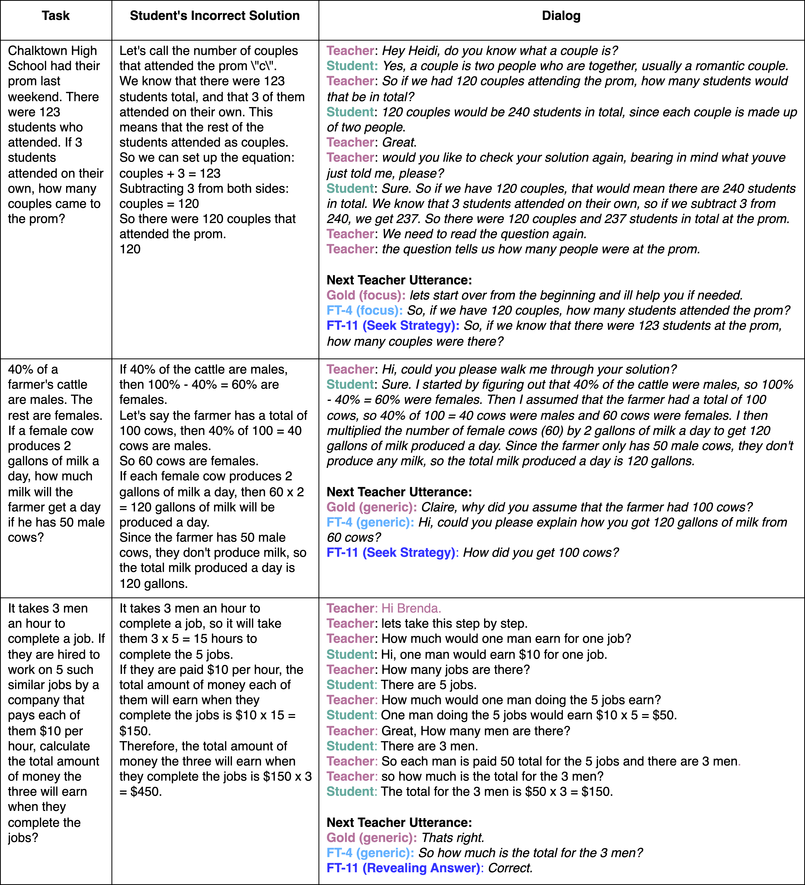

# Intent Matters: Enhancing AI Tutoring with Fine-Grained Pedagogical Intent Annotation

[Kseniia Petukhova](https://scholar.google.com/citations?user=XsiLKJcAAAAJ&hl=en&oi=ao), [Ekaterina Kochmar](https://ekochmar.github.io/about/)


## Overview
This repository serves as the official implementation hub for the paper:

Intent Matters: Enhancing AI Tutoring with Fine-Grained Pedagogical Intent Annotation

Large language models (LLMs) hold great promise for educational applications, particularly in intelligent tutoring systems. However, effective tutoring requires alignment with pedagogical strategies -- something current LLMs lack without task-specific adaptation. In this work, we explore whether fine-grained annotation of teacher intents can improve the quality of LLM-generated tutoring responses. We focus on MathDial, a dialog dataset for math instruction, and apply an automated annotation framework to re-annotate a portion of the dataset using a detailed taxonomy of eleven pedagogical intents. We then fine-tune an LLM using these new annotations and compare its performance to models trained on the original four-category taxonomy. Both automatic and qualitative evaluations show that the fine-grained model produces more pedagogically aligned and effective responses. Our findings highlight the value of intent specificity for controlled text generation in educational settings.

This repository contains our re-annotated dataset and code for controlled generation experiments.



---

## 📁 Project Structure

```
annotation/
├── dialogs_test_annotated.tsv     # Test split annotated with 11 predicted intents (Predicted_Intents)
├── dialogs_train_annotated.tsv    # Training split annotated with 11 predicted intents (Predicted_Intents)
├── dialogs_val_annotated.tsv      # Validation split annotated with 11 predicted intents (Predicted_Intents)
├── mathdial_intents.tsv           # List of intents used, based on MathDial
├── split_selection_tree.json      # Annotation tree generated using the framework from Petukhova & Kochmar (2025)
├── test.tsv                       # Test split (no annotations)
├── train.tsv                      # Training split (no annotations)
└── val.tsv                        # Validation split (no annotations)

├── controlled_generation_mathdial.ipynb    # Notebook for controlled generation experiments
├── test_4_intents.jsonl                    # Test set with original 4 intent labels
├── test_11_intents.jsonl                   # Test set with 11 predicted intents
├── train_4_intents.jsonl                   # Training set with original 4 intent labels
├── train_11_intents.jsonl                  # Training set with 11 predicted intents
├── val_4_intents.jsonl                     # Validation set with original 4 intent labels
└── val_11_intents.jsonl                    # Validation set with 11 predicted intents
```

For information on how to use the annotation framework, please refer [here](https://github.com/Kpetyxova/autoTree/tree/main?tab=readme-ov-file#a-fully-automated-pipeline-for-conversational-discourse-annotation-tree-scheme-generation-and-labeling-with-large-language-models) 

